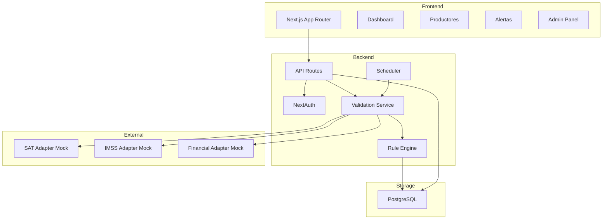

# Portal de Monitoreo Financiero-Fiscal para Productores

Portal de diagnóstico y monitoreo para productores agrícolas (caso Driscoll's). Sistema completo para detectar riesgos fiscales/financieros (SAT, IMSS, liquidez/endeudamiento), emitir alertas y ofrecer visibilidad mediante dashboards y fichas por productor.

## 🌟 Características Principales

- ✅ **Diagnóstico One-Shot**: Análisis instantáneo de cumplimiento fiscal y financiero
- 🔄 **Monitoreo Recurrente**: Validaciones programadas con node-cron
- 📊 **Motor de Reglas Configurable**: 5 reglas predefinidas editables sin re-deploy
- 👥 **RBAC Completo**: Roles ADMIN, ANALYST, PRODUCER con permisos diferenciados
- 📈 **Dashboards Interactivos**: KPIs, gráficos por zona/cultivo, alertas en tiempo real
- 📤 **Exportes CSV**: Descarga de alertas por periodo
- 🎯 **Adapters Mock**: SAT, IMSS y Financial con respuestas deterministas

## 🛠️ Stack Tecnológico

### Frontend
- **Next.js 14** (App Router)
- **TypeScript**
- **Tailwind CSS**
- **Recharts** para visualizaciones

### Backend
- **Next.js API Routes**
- **NextAuth** para autenticación (email/password + JWT)
- **node-cron** para tareas programadas
- **PostgreSQL administrado** con repositorio transaccional y consultas parametrizadas

### Seguridad
- **bcrypt** para hashing de contraseñas
- **Zod** para validación de inputs
- **Audit logging** en acciones críticas

## 📁 Estructura del Proyecto

```
.
├── app/                      # Next.js App Router
│   ├── api/                  # API Routes
│   │   ├── auth/            # NextAuth endpoints
│   │   ├── producers/       # Gestión de productores
│   │   ├── alerts/          # Gestión de alertas
│   │   ├── rules/           # CRUD de reglas
│   │   ├── validation/      # Ejecución de validaciones
│   │   ├── scheduler/       # Control del scheduler
│   │   └── exports/         # Exportación CSV
│   ├── dashboard/           # Dashboard principal
│   ├── producers/           # Lista y fichas de productores
│   ├── alerts/              # Gestión de alertas
│   ├── admin/               # Panel administrativo
│   │   ├── rules/          # Editor de reglas
│   │   └── scheduler/      # Configuración de scheduler
│   └── login/               # Página de login
├── components/              # Componentes React
│   ├── ui/                 # Componentes UI (shadcn-ready)
│   └── nav-bar.tsx         # Navegación principal
├── lib/                     # Lógica de negocio
│   ├── adapters/           # Adapters mock (SAT, IMSS, Financial)
│   ├── auth/               # Configuración NextAuth
│   ├── db/                 # Repositorio PostgreSQL y validación de respaldos
│   ├── rules/              # Motor de reglas
│   ├── services/           # Servicios (validation, scheduler)
│   └── utils/              # Utilidades
├── db/migrations/           # Migraciones SQL versionadas
├── scripts/                 # Migración, importación, respaldo y restauración
├── types/                   # Definiciones TypeScript
│   └── index.ts            # Tipos principales
└── data/
    └── db.json             # Fuente histórica para una importación inicial
```

## 🚀 Configuración e Instalación

### 1. Variables de Entorno

Crea un archivo `.env.local` (ya existe uno preconfigura do):

```bash
# NextAuth Configuration
NEXTAUTH_SECRET="demo-secret-key-12345678901234567890"
NEXTAUTH_URL="http://localhost:3000"

# Mock External APIs
SAT_API_KEY="demo-sat-key"
IMSS_API_KEY="demo-imss-key"

# Optional Features
ENABLE_GOOGLE_AUTH=false
```

### 2. Instalar Dependencias

```bash
npm install
```

### 3. Inicializar PostgreSQL

```bash
npm run db:migrate
npm run seed -- --confirm
```

La semilla demo autocontenida crea:
- 3 usuarios demo (admin, analyst, producer)
- 10 productores con perfiles variados
- 21 razones sociales
- 19 ranchos
- 28 cultivos
- 42 snapshots financieros
- 5 reglas de validación
- 5 alertas de ejemplo

### 4. Iniciar Servidor de Desarrollo

```bash
npm run dev
```

La aplicación estará disponible en: http://localhost:5000

## 👤 Usuarios Demo

| Email | Contraseña | Rol | Permisos |
|-------|-----------|-----|----------|
| admin@demo.local | Admin123! | ADMIN | Acceso completo + gestión de reglas y scheduler |
| analyst@demo.local | Analyst123! | ANALYST | Dashboard, productores, alertas, validaciones |
| producer@demo.local | Producer123! | PRODUCER | Solo su ficha y alertas propias |

## 🏗️ Arquitectura del Sistema



## 🔍 Flujos Principales

### Diagnóstico One-Shot

1. Usuario hace clic en "Diagnóstico" en la ficha de productor
2. Sistema crea ValidationTask por cada tipo (SAT, IMSS, FINANCIERA, LEGAL)
3. Se invocan los adapters correspondientes
4. El RuleEngine evalúa reglas activas
5. Se generan alertas según resultados
6. Se actualiza el semáforo de estado del productor

### Monitoreo Recurrente

1. node-cron ejecuta según programación (demo: mensual)
2. Se seleccionan entidades por cohorte (zona o lista)
3. Se ejecutan validaciones completas
4. Si cambian métricas → nuevas alertas
5. Se registra en AuditLog

## 📊 Modelo de Datos

### Entidades Principales

- **User**: Usuarios del sistema con roles RBAC
- **Producer**: Productores agrícolas
- **LegalEntity**: Razones sociales (personas morales/físicas)
- **Ranch**: Ranchos/unidades productivas
- **Crop**: Cultivos (fresa, frambuesa, arándano, mora)
- **FinancialSnapshot**: Snapshots financieros por periodo
- **ValidationTask**: Tareas de validación ejecutadas
- **Alert**: Alertas generadas por el sistema
- **Rule**: Reglas de validación configurables
- **AuditLog**: Bitácora de auditoría

## 🎯 Reglas de Validación Iniciales

| Código | Nombre | Severidad | Tipo | Descripción |
|--------|--------|-----------|------|-------------|
| SAT_OPINION_NEGATIVA | Opinión SAT Negativa | HIGH | BOOLEAN | Detecta opinión negativa del SAT |
| IMSS_SUSPENSION | Suspensión IMSS | HIGH | BOOLEAN | Detecta estatus suspendido en IMSS |
| ENDEUDAMIENTO_ALTO | Endeudamiento Alto | HIGH | THRESHOLD | Endeudamiento > 35% |
| LIQUIDEZ_BAJA | Liquidez Baja | MEDIUM | THRESHOLD | Liquidez < umbral (1.0) |
| PODERES_VENCIDOS | Poderes Vencidos | MEDIUM | CUSTOM | Poderes notariales vencidos/próximos |

## 🧪 Criterios de Aceptación (QA Manual)

### ✅ Flujo Completo

1. **Login**: Ingresar con usuario admin/analyst/producer
2. **Dashboard**: Verificar KPIs, gráficos y alertas recientes
3. **Productores**: Filtrar por zona/estado, ver listado
4. **Diagnóstico One-Shot**: Ejecutar en un productor → ver alertas generadas
5. **Ficha de Productor**: Ver razones sociales, ranchos, cultivos, financiero, alertas
6. **Alertas**: Filtrar, resolver, exportar CSV
7. **Reglas (Admin)**: Ver, activar/desactivar, modificar configuración
8. **Scheduler (Admin)**: Ejecutar monitoreo manual por zona

### ✅ RBAC

- ADMIN: Acceso a /admin/*
- ANALYST: Acceso a dashboard, productores, alertas, validación
- PRODUCER: Solo su ficha y alertas propias (limitado)

## 📦 Scripts Disponibles

```bash
# Desarrollo
npm run dev          # Inicia servidor en puerto 5000

# Producción
npm run build        # Construye para producción
npm run start        # Inicia servidor de producción

# Datos y recuperación
npm run db:migrate                 # Aplica las migraciones SQL pendientes
npm run db:import                  # Importa una fuente JSON histórica solo si la base está vacía
npm run seed -- --confirm           # Reemplaza los datos de desarrollo con el dataset demo (no disponible en producción)
npm run db:backup                  # Crea un respaldo lógico con checksum (carpeta backups/)
npm run db:restore -- archivo --confirm # Restaura un respaldo fuera de producción
npm run db:restore-test            # Prueba un respaldo/restauración en desarrollo
npm run lint                       # Ejecuta ESLint
```

## 🗄️ Operación de datos

- `data/db.json` se conserva solo como fuente de migración; la aplicación nunca lo lee ni escribe.
- Las migraciones están en `db/migrations/` y se registran en `schema_migrations`.
- El respaldo es un JSON lógico con conteos y SHA-256; se escribe con permisos de propietario y `backups/` se excluye de Git.
- La importación que reemplaza datos y la restauración exigen confirmación explícita; ambas están bloqueadas cuando `NODE_ENV=production`.
- La restauración verifica formato, checksum, relaciones, conteos y el contenido completo restaurado antes de confirmar que el proceso fue exitoso.
- En Replit, los cambios de esquema de producción se aplican mediante el flujo de Publish administrado. No ejecute scripts de DDL ni restauraciones directas contra producción.

### Simulacro de restauración

Ejecute `npm run db:restore-test` periódicamente en desarrollo. El comando crea un respaldo temporal, introduce una bitácora de prueba, restaura el respaldo y confirma que el estado resultante coincide exactamente con el punto de partida.

## 🚀 Próximas Fases

### Entregas por etapa

- **Etapa 1 (activa):** importación administrativa de productores desde CSV, validación separada, vista previa de 20 filas, modos todo-o-nada o solo válidos, rechazos descargables y plantilla.
- **Etapa 2 (controlada):** reportes. Se habilita únicamente con `STAGE_2_ENABLED=true`; mientras sea `false`, el enlace no aparece y el acceso directo a `/reports` redirige al dashboard.

El catálogo de distritos puede configurarse con `PRODUCER_IMPORT_DISTRICTS` como una lista separada por comas. La configuración de ejemplo propone los seis valores observados en el padrón: `Jalisco,Puebla,Guanajuato,Colima,Michoacan,Altos - Bajio`; todos deben confirmarse contra el catálogo oficial de Driscoll's antes de activarse en un entorno operativo. Si la variable no está definida, el importador exige un distrito no vacío y muestra una sola advertencia por archivo.

- [ ] Integración con APIs reales de SAT e IMSS
- [ ] Reglas avanzadas con multi-condiciones
- [ ] Notificaciones por email/SMS
- [ ] Analytics avanzado con tendencias
- [ ] Sistema de gestión documental
- [ ] Dashboard ejecutivo con BI

## 📝 Notas de Desarrollo

- **Sin Docker**: El entorno usa Nix, no se requiere virtualización
- **Puerto 5000**: Único puerto no bloqueado por firewall en Replit
- **LSP Warnings**: Normales hasta que Next.js compile, se resuelven al iniciar
- **PostgreSQL**: La aplicación requiere la base administrada configurada por Replit; no configure ni exponga credenciales manualmente.

## 🤝 Contribución

Este es un MVP funcional. Para agregar features:

1. Crear nueva regla en `lib/rules/engine.ts`
2. Agregar endpoint en `app/api/`
3. Crear componente en `components/`
4. Actualizar tipos en `types/index.ts`

## 📄 Licencia

Proyecto demo para Driscoll's - Uso interno

---

**Desarrollado con Next.js 14 + TypeScript + Tailwind CSS**
